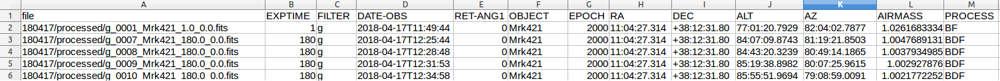

# TRIPOLpy
This is a small package developed purely for TRIPOL installed at Seoul National University (SNU) since 2017. The TRIPOL is provided by the courtesy of prof. Shuji Sato (Nagoya Univ), and installed by the following people:

| Name              | Affiliation              | Position in 2018        |
| ----------------- | ------------------------ | ----------------------- |
| Masateru Ishiguro | SNU                      | Professor               |
| Jin-Guk Seo       | SNU                      | Instrument/Telescope TA |
| Jiyong Youn       | SNU                      | Undergraduate student   |
| Jaeki Park        | Daekee Machining Company |                         |
| Yuna G. Kwon      | SNU                      | PhD student             |
| Sunho Jin         | SNU                      | MS student              |
| Yoonsoo P. Bach   | SNU                      | PhD student             |

This package is developed using Python 3.6 since it (is)

* Free (Python 2/3, IRAF)
* Stable (Python 2/3, IRAF, IDL)
* OS independent (Python 2/3, julia, IDL)
* Version controllable via simple platform (julia, Python 2/3 via git + conda)
* Has long term plans to be managed by professionals (Python 3, julia, IDL)
* Will be used in future astronomy projects (Python 3, julia, C++)
* Has strong user-friendly astronomy-related package support (~~low-level languages~~)

The only remaining language is Python 3. We selected Python 3.6 since it will be the only language supported by astropy 4.0 LTS (see [astropy APE 10](https://github.com/astropy/astropy-APEs/blob/master/APE10.rst)).


## Requirements

We tested TRIPOLpy under the following conditions:

* **Python 3.6 +**
* scipy 1.0.0
* numpy 1.14.2
* astropy 3.0.1
* ccdproc 1.3

Code validity tested on Windows 10 and Ubuntu 16.04.

## Installation

### If you are first to python

Go download [Anaconda 3](https://www.anaconda.com/download/) of appropriate OS you are using. Install as the website says.

> **IMPORTANT**
>
> For Windows users: while installing, **CHECK** the checkbox which includes "PATH blahblah"
>
> For UNIX machine: Answer **yes** to the path related question.


Go download [Git](https://git-scm.com/downloads) for your OS and install it.

After installations, turn on a terminal (Windows users: ``win`` key -> Search for Git Bash or Anaconda Prompt) 

```
$ conda update --all
```

It may take a while if you are doing it for the first time.

Now go to "If you are already a python user" section.


### If you are already a python user

Only ccdproc is non-core package from conda, so you must install it via 

```
$ conda install -c astropy ccdproc
```

Then

```
$ mkdir ~/github
$ cd ~/github
$ git clone https://github.com/ysBach/TRIPOLpy.git
$ cd TRIPOLpy
$ python setup.py install
```


## Usage

To test, you may want to download the data from TRIPOL NAS server (https://147.46.40.80:5003; see below).

### Simple Version

Short code to do the calibration (detailed: see below):

```python
from tripolpy import preprocessor
from astropy.table import Table
from pathlib import Path
datedir = Path("180417")
p = preprocessor.Preprocessor(topdir=datedir, rawdir = datedir / "rawdata")
p.organize_tripol(archive_dir=datedir / "rawdata" / "archive")
p.make_bias(savedir=datedir / "calibration")

# =============================================================================
# NOTE: If you observed in before May, 
# =============================================================================
#p.make_bias(savedir=datedir / "calibration",
#            hdr_keys=["OBJECT", "EXPTIME"], # Default is "OBJECT"
#            hdr_vals=["dark", 0.0])         # Default is "bias"
p.make_dark(savedir=datedir / "calibration")
p.make_flat(savedir=datedir / "calibration")
summary_reduced = p.do_preproc(savedir=datedir / "processed")
```

It then automatically finds bias, dark, and flat images for each CCD, exposure time (dark only), and each HWP angle (for flat only). The object-like images, i.e., ``OBJECT`` not starts with bias, dark, flat, or test, are preprocessed automatically and saved to ``180417/processed`` directory.

The whole process took **about 30 sec for 424 images** obtained on 2018-04-17 KST.


### Detailed Version

The **same code** with longer description comments is presented below:

```python
from tripolpy import preprocessor
from astropy.table import Table
from pathlib import Path

# The date directory (relative to your current working directory)
datedir = Path("180417")

# rawdir is the directory where the FITS files are located.
p = preprocessor.Preprocessor(topdir=datedir, rawdir = datedir / "rawdata")

# =============================================================================
# 1. Organize the files and initilize the ``Preprocessor`` class
# =============================================================================
p.organize_tripol(archive_dir=datedir / "rawdata" / "archive")

# Identical to
#p.organize_tripol(archive_dir=datedir / "rawdata" / "archive",
#                  rename_by=["FILTER", "COUNTER", "OBJECT", "EXPOS", "RET-ANG1"],
#                  delimiter='_',
#                  mkdir_by=["FILTER", "OBJECT"],
#                  verbose=False)

# =============================================================================
# 2. Make Bias frames.
# =============================================================================

# If you observed after May:
p.make_bias(savedir=datedir / "calibration")

# Identical to
#MEDCOMB_KEYS = dict(overwrite=True,
#                    unit=None,
#                    combine_method="median",
#                    reject_method=None,
#                    combine_uncertainty_function=None)
#p.make_bias(savedir=datedir / "calibration",
#            hdr_keys=["OBJECT", "EXPTIME"],
#            hdr_vals=["dark", 0.0],
#            group_by=["FILTER"],
#            delimiter='_',
#            dtype='float32',
#            comb_kwargs=MEDCOMB_KEYS)

# =============================================================================
# NOTE: If you observed in before May, 
# =============================================================================
#p.make_bias(savedir=datedir / "calibration",
#            hdr_keys=["OBJECT", "EXPTIME"], # Default is "OBJECT"
#            hdr_vals=["dark", 0.0])         # Default is "bias"

# Identical to
#MEDCOMB_KEYS = dict(overwrite=True,
#                    unit=None,
#                    combine_method="median",
#                    reject_method=None,
#                    combine_uncertainty_function=None)
#p.make_bias(savedir=datedir / "calibration",
#            hdr_keys=["OBJECT", "EXPTIME"],
#            hdr_vals=["dark", 0.0],
#            group_by=["FILTER"],
#            delimiter='_',
#            dtype='float32',
#            comb_kwargs=MEDCOMB_KEYS)

# =============================================================================
# 3. Make Dark frames
# =============================================================================
p.make_dark(savedir=datedir / "calibration")

# Identical to
#MEDCOMB_KEYS = dict(overwrite=True,
#                    unit=None,
#                    combine_method="median",
#                    reject_method=None,
#                    combine_uncertainty_function=None)
#p.make_dark(savedir=datedir / "calibration",
#            hdr_keys="OBJECT",
#            hdr_vals="dark",
#            group_by=["FILTER", "EXPTIME"],
#            bias_sub=True,
#            bias_grouped_by=["FILTER"],
#            exposure_key="EXPTIME",
#            dtype='float32',
#            delimiter='_',
#            comb_kwargs=MEDCOMB_KEYS)

# =============================================================================
# 4. Make Flat frames
# =============================================================================

p.make_flat(savedir=datedir / "calibration")

# Identical to
#MEDCOMB_KEYS = dict(overwrite=True,
#                    unit=None,
#                    combine_method="median",
#                    reject_method=None,
#                    combine_uncertainty_function=None)
#p.make_flat(savedir=datedir / "calibration",
#            hdr_keys=["OBJECT"],
#            hdr_vals=["flat"],
#            group_by=["FILTER", "RET-ANG1"],
#            bias_sub=True,
#            dark_sub=True,
#            bias_grouped_by=["FILTER"],
#            dark_grouped_by=["FILTER", "EXPTIME"],
#            exposure_key="EXPTIME",
#            comb_kwargs=MEDCOMB_KEYS,
#            delimiter='_',
#            dtype='float32')

# =============================================================================
# 5. Preprocess all the object-like frames
# =============================================================================

summary_reduced = p.do_preproc(savedir=datedir / "processed")

# Identical to
#p.do_preproc(savedir=datedir / "processed",
#             delimiter='_',
#             dtype='float32',
#             exposure_key="EXPTIME",
#             bias_grouped_by=["FILTER"],
#             dark_grouped_by=["FILTER", "EXPTIME"],
#             flat_grouped_by=["FILTER", "RET-ANG1"],
#             verbose=True)
```


### Result of the Code

#### File Tree

Originally the file tree is

```
.
├── next.txt
└── rawdata
    ├── g180417_0001.fits
	...
    ├── r180417_0140.fits
    └── r.fits
1 directory, 424 files
```

After running the code,

```
.
├── biaspaths.list
├── biaspaths.pkl
...
├── summary_raw.csv
├── summary_reduced.csv
├── calibration
│   ├── bias_g.fits
│   ├── dark_g_0.0.fits
│   ├── flat_g_0.0.fits
│   └── ...
├── processed
│   ├── g_0001_Mrk421_1.0_0.0.fits
│   └── ...
├── rawdata
│   ├── archive
│   │   ├── g180417_0001.fits
│   │   └── ...
│   ├── g
│   │   ├── dark
│   │   │   ├── g_0054_dark_0.4_0.0.fits
│   │   │   └── ...
│   │   ├── flat
│   │   │   ├── g_0103_flat_2.0_0.0.fits
│   │   │   └── ...
│   │   ├── HIP52181
│   │   │   ├── g_0017_HIP52181_120.0_0.0.fits
│   │   │   └── ...
...
│   │   ├── Mrk421_225
│   │   │   ├── g_0023_Mrk421_225_180.0_22.5.fits
│   │   │   └── ...
...
│   ├── i
...
│   ├── r
...
│   └── useless
│       └── ...

35 directories, 955 files

```

* ``xxx.list``: The plain list of file paths to combined bias, dark, flat, renamed raw data, and object-like files.

* ``xxx.pkl``: same as the ``.list`` file but python-pickle format.

* ``summary``: The summary csv file for the original raw data and only the reduced data:

  

* ``calibration/``: The calibration images directory, e.g., bias (``bias_<FILTER>.fits``), dark (``dark_<FILTER>_<EXPTIME>.fits``), and flat (``flat_<FILTER>_<RET-ANG1>.fits``). 

* ``processed/``: The processed data directory (``<FILTER>_<COUNTER>_<OBJECT>_<EXPTIME>_<RET-ANG1>.fits``).

* ``rawdata/``: The original FITS are moved to ``rawdata/archive/``. The original FITS but with updated header and filename are moved to ``rawdata/<FILTER>/<OBJECT>`` with filenames of ``<FILTER>_<COUNTER>_<OBJECT>_<EXPTIME>_<RET-ANG1>``. Useless images, e.g., ``OBJECT`` starts with ``TEST`` or i-band image when taking g-band flat, etc are moved to ``rawdata/useless``.


#### Headers

The headers are also updated:

1. **Deprecation**: If the original key is not standard, e.g.,

   ```
   EGAIN   =                  2.0 / Deprecated. See GAIN      
   GAIN    =                 12.5 / [e-/ADU] The electron gain factor (Apr2018). 
   COMMENT Gain history (i-band CCD): {'default': 2.0, 'Apr2018': 12.5} e/ADU.      
   ```

   * Number 12.5 is just a test value to visualize the change. In the real code, it is 2.0.

2. **Calculation**: ``Alt``, ``Az`` and `AIRMASS` are not added to FITS due to JUSTEK software problem, so

   ```
   AIRMASS =    1.015958579829999 / Aaverage airmass (Stetson 1988)                
   ALT     = '79:54:54.6082'      / Altitude (start of the exposure)               
   AZ      = '206:19:18.5691'     / Azimuth (start of the exposure)                
   ALT_MID = '79:49:30.5259'      / Altitude (midpoint of the exposure)            
   AZ_MID  = '207:28:03.5473'     / Azimuth (midpoint of the exposure)             
   ALT_END = '79:43:53.8377'      / Altitude (end of the exposure)                 
   AZ_END  = '208:35:39.3983'     / Azimuth (end of the exposure)          
   COMMENT TRIPOLpy's airmass calculation uses the same algorithm as IRAF: From 'So
   COMMENT me Factors Affecting the Accuracy of Stellar Photometry with CCDs' by P.
   COMMENT  Stetson, DAO preprint, September 1988.                                 
   HISTORY ALT-AZ calculated from TRIPOLpy.                                        
   HISTORY AIRMASS calculated from TRIPOLpy.                                       
   ```

3. **Miscellaneous**: `BUNIT`, `COUNTER` are added for future information and `RET-ANG1` is inferred from the ``OBJECT`` if it does not exist in the original file. ``PROCESS`` indicates which processes have been done (see ``COMMENT`` and ``HISTORY``)

   ```COMMENT PROCESS key can be B (bias), D (dark), F (flat), T (trim), W (WCS).     
   COUNTER = '0012    '           / Image counter                                  
   BUNIT   = 'ADU     '           / Pixel value unit                  
   RET-ANG1=                  0.0 / The half-wave plate angle.          
   PROCESS = 'BDF     '           / The processed history: see comment.            
   COMMENT PROCESS key can be B (bias), D (dark), F (flat), T (trim), W (WCS).     
   HISTORY Bias subtracted using 180417/calibration/bias_r.fits                    
   HISTORY Dark subtracted using 180417/calibration/dark_r_120.0.fits              
   HISTORY Flat corrected using 180417/calibration/flat_r_0.0.fits        
   ```


## About TRIPOL

### Observatory computer screenshot

* http://147.46.40.80:81/screenshot.png
* Every 3 minutes, the screenshot of the observatory Windows computer (which the JTCS will be running) is uploaded to here.


### Data server (NAS)

* https://147.46.40.80:5003
* All the data and screenshots are archived in this server.
* ID / PW = contact TA: dbstn95@gmail.com


### TRIPOL computer

* The Ubuntu computer in the observatory room.
* PW = contact TA: dbstn95@gmail.com


### Manual

* Contact TA: dbstn95@gmail.com
* Chapter 3 and 4 will be important.
  * ``start_ccd``, ``set_temp``, ``print_temp``, ``TL``, ``Lo``, etc
* At the last page, the spec of the CCD is given. But this is **DIFFERENT** one from our TRIPOL! Do not use this information...


### SDSS Prime Standard Stars

The SDSS u'g'r'i'z' standard stars can be found at [here](http://www-star.fnal.gov/ugriz/tab08.dat) or my personal [Google Docs](https://drive.google.com/open?id=1flvTCjORDbEi368Ls7wliJRp3EeEjtOyK5bEfu-IQw8).

For all the information for the standard stars (SDSS u'g'r'i'z'), see [here](http://www-star.fnal.gov/).


## Bug Report

Please open an issue [here](https://github.com/ysBach/TRIPOLpy/issues)!


## Acknowledgement

**Prof. Myungshin Im** at SNU has financially supported TRIPOL project.

**Gunwoo Kang**, an undergraduate student at SNU in 2018, contributed parts in the airmass calculation code. 